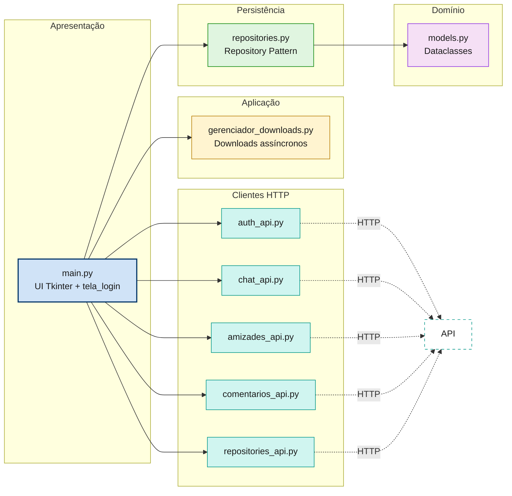
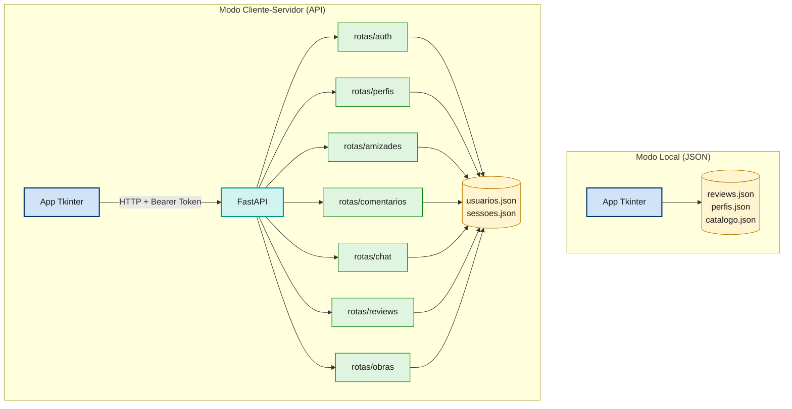
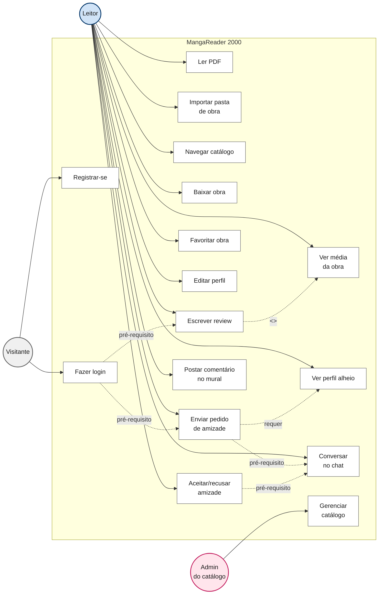

# 📖 MangaReader 2000 — Retro Edition

> Leitor de mangás e PDFs com interface inspirada na era Windows XP / 7 — um sistema distribuído com leitura, catálogo, downloads e funcionalidades sociais (perfis, amizades, mural e chat).


---

## 🤖 Sobre o uso de IA e Vibe Coding

Este projeto foi desenvolvido em **colaboração com modelos de linguagem (IA)** — DeepSeek, ChatGPT e Gemini — dentro de uma abordagem conhecida como **Vibe Coding**: eu descrevo o que quero, discuto arquitetura, valido decisões técnicas e a IA sugere implementações. **O julgamento técnico, as escolhas de design e a direção do projeto são meus.**

### Como a IA foi usada (e como **não** foi)

| ✅ A IA ajudou com | 🧠 O que ficou sob minha responsabilidade |
|---|---|
| Esqueleto de código repetitivo (widgets, layouts, boilerplate) | Decidir a arquitetura em 3 camadas e o Repository Pattern |
| Sugestões de nomes, mensagens de erro e UX | Definir o que o app deve fazer e para quem |
| Explicações didáticas (Protocols, threads, HTTP, FastAPI, bcrypt) | Revisar, testar e corrigir tudo antes de commitar |
| Refatorações guiadas (separação em `models/`, `repositories/`, `main`) | Questionar sugestões quando não faziam sentido |
| Discussões de trade-offs entre abordagens | Aprender cada conceito antes de aplicar |

### Por que isso importa

IA é uma ferramenta como compilador, IDE ou framework. O que define um bom desenvolvedor **não é se ele usa IA**, e sim:
- Se ele **entende** o que o código faz
- Se ele sabe **quando** uma sugestão está errada
- Se ele consegue **defender** cada decisão técnica

Todo o código deste repositório foi **lido, testado e ajustado por mim**. As decisões de arquitetura estão documentadas na seção [Padrões e Decisões Técnicas](#-padrões-e-decisões-técnicas) e podem ser discutidas linha a linha.

---

## 🎯 Sobre o Projeto

**MangaReader 2000** é um sistema distribuído desenvolvido em **Python** como projeto de estudo e portfólio de Engenharia de Software. Combina um **leitor desktop de PDFs** com uma **API REST própria**, formando uma mini rede social de leitura com autenticação, perfis, amizades, mural de recados e chat privado.

O projeto foi construído com foco em **arquitetura limpa**, **separação de responsabilidades** e **padrões profissionais** aplicados a um domínio real.

**Diferencial:** o app roda em **dois modos** — local (JSON) ou cliente-servidor (HTTP) — permitindo demonstrar desde um app desktop simples até um sistema distribuído com API REST própria, autenticação e comunicação em tempo real.

---

## 📸 Screenshots

| Tela Inicial | Catálogo | Perfil |
|---|---|---|
|  |  |  |

---

## ✨ Funcionalidades

### 📚 Leitura
- **Leitor PDF com zoom adaptativo** via `PyMuPDF` (fitz.Matrix), sem travamentos
- **Navegação por teclado** (setas ⬅️ / ➡️)
- **Retomada automática** da página onde parou
- **Marcação de volumes como lidos** (✔) via menu de contexto

### 📂 Biblioteca
- **Organização em 3 níveis**: Obras → Volumes → Leitor
- **Detecção automática** de obras em `pdf_padrao/`
- **Importação de pastas** do PC do usuário
- **Capas geradas** automaticamente a partir da 1ª página de cada PDF

### 🛒 Catálogo & Downloads
- **Catálogo de obras** disponíveis para download
- **Downloads assíncronos** com barra de progresso (thread + `queue.Queue`)
- **Escrita atômica** — arquivos gravados como `.parcial` e renomeados só ao concluir
- **Cancelamento em cadeia** (para todos os volumes da série)
- **Tratamento de colisão** de arquivos (substituir / pular / cancelar)

### 👤 Perfil & Social
- **Autenticação** com registro e login (bcrypt + Bearer Token)
- **Sessão persistente** — "não perguntar de novo neste dispositivo"
- **Perfis editáveis** com bio, foto e favoritos
- **Reviews com CRUD completo** — nota, texto, edição e exclusão
- **Média das reviews** integrada ao catálogo e à biblioteca
- **Favoritos** com limite de 5 por perfil

### 👥 Amizades
- **Pedidos de amizade** entre usuários (enviar / aceitar / recusar)
- **Lista de amigos** real, sincronizada via API
- **Desfazer amizade** por menu de contexto

### 💬 Mural de Recados
- **Comentários** no perfil de outros usuários
- **Permissões**: autor e dono do mural podem deletar
- **Visualização de perfil alheio** ao clicar num amigo

### 💌 ChatoChat
- **Chat privado** entre amigos (só amigos podem conversar)
- **Polling automático** a cada 3s para novas mensagens
- **Badge de não lidas** na sidebar de conversas
- **Bolhas estilizadas** — enviadas à direita (azul), recebidas à esquerda (cinza)
- **Auto-scroll inteligente** — só rola se você já estava no fim

### 🌐 API REST
- **Endpoints** para usuários, perfis, reviews, catálogo, amizades, mural e chat
- **Autenticação** via Bearer Token
- **Persistência JSON** compartilhada com o app
- **Cascade delete** — deletar perfil remove dados relacionados
- **Agregações** — média de reviews por obra
- **Documentação automática** via Swagger UI (`/docs`)
- **Indicador de status** na toolbar (conectado / offline / modo local)

---

## 🏗️ Arquitetura

O projeto segue uma divisão em **3 camadas**, com dependências apontando em uma única direção:



### Modos de operação



A escolha do modo é feita em **1 linha** no composition root (`main.py`):
```python
MODO = "api"   # ou "local"
```

### Estrutura de arquivos

```
PDF_Reader/
├── README.md
└── PDF_Reader/
    ├── main.py                       # UI Tkinter + composition root
    ├── tela_login.py                 # Tela de login/registro
    ├── models.py                     # Entidades (clientes)
    ├── repositories.py               # Repositórios JSON (cliente)
    ├── repositories_api.py           # Cliente HTTP de reviews
    ├── auth_api.py                   # Cliente HTTP de auth + sessão
    ├── amizades_api.py               # Cliente HTTP de amizades
    ├── comentarios_api.py            # Cliente HTTP de mural
    ├── chat_api.py                   # Cliente HTTP de chat
    ├── gerenciador_downloads.py      # Downloads assíncronos
    ├── api_teste.py                  # Ponto de entrada da API FastAPI
    ├── catalogo.json                 # Catálogo de obras
    │
    ├── dominio/                      # Domínio autocontido da API
    │   ├── models.py
    │   ├── repositories.py
    │   └── state.py                  # Singletons compartilhados
    │
    ├── rotas/                        # Rotas da API
    │   ├── obras.py                  # /catalogo
    │   ├── perfis.py                 # /perfis
    │   ├── reviews.py                # /reviews
    │   ├── auth.py                   # /auth
    │   ├── amizades.py               # /amizades
    │   ├── comentarios.py            # /comentarios
    │   └── chat.py                   # /chat
    │
    ├── assets/icones/                # Ícones da toolbar
    └── pdf_padrao/                   # Biblioteca local de PDFs
```

---

## 🎬 Diagrama de Casos de Uso



**Atores:**
- **Visitante** — usuário não autenticado. Só pode registrar/logar.
- **Leitor** — usuário autenticado. Acesso completo às funcionalidades sociais.
- **Admin do catálogo** — mantém o `catalogo.json` (editando o arquivo diretamente).

**Relações:**
- `pré-requisito` — ações que exigem login prévio
- `<<include>>` — Escrever review sempre atualiza a média da obra
- `requer` — Enviar pedido requer conhecer o perfil do outro

---

## 🗺️ Roadmap do MVP

```mermaid
graph LR
    subgraph "✅ Fase 1 — Leitor Base"
        F1A[Leitor de PDF]
        F1B[Zoom adaptativo]
        F1C[Retomada de página]
        F1D[Marcação de lido]
    end

    subgraph "✅ Fase 2 — Biblioteca & Downloads"
        F2A[Importar pasta]
        F2B[Catálogo de obras]
        F2C[Downloads assíncronos]
        F2D[Cancelamento + colisão]
    end

    subgraph "✅ Fase 3 — Perfil & Social"
        F3A[Perfil editável]
        F3B[Favoritos]
        F3C[Reviews + média]
        F3D[ChatoChat simulado]
    end

    subgraph "✅ Fase 4 — API REST + Auth"
        F4A[FastAPI + rotas]
        F4B[Repository compartilhado]
        F4C[Login/registro bcrypt]
        F4D[Indicador de status]
    end

    subgraph "✅ Fase 5 — Rede Social"
        F5A[Pedidos de amizade]
        F5B[Mural de recados]
        F5C[Chat privado real]
        F5D[Polling de mensagens]
    end

    subgraph "🚧 Fase 6 — Futuro"
        F6A[Notificações estilo MSN]
        F6B[Buscar usuários]
        F6C[Som de mensagem]
        F6D[Empacotamento .exe]
    end

    F1A --> F2A
    F1B --> F2B
    F1C --> F2C
    F1D --> F2D
    F2A --> F3A
    F2B --> F3B
    F2C --> F3C
    F2D --> F3D
    F3A --> F4A
    F3B --> F4B
    F3C --> F4C
    F3D --> F4D
    F4A --> F5A
    F4B --> F5B
    F4C --> F5C
    F4D --> F5D
    F5A --> F6A
    F5B --> F6B
    F5C --> F6C
    F5D --> F6D

    style F1A fill:#E0F5E0,stroke:#008000,color:#1a1a1a
    style F1B fill:#E0F5E0,stroke:#008000,color:#1a1a1a
    style F1C fill:#E0F5E0,stroke:#008000,color:#1a1a1a
    style F1D fill:#E0F5E0,stroke:#008000,color:#1a1a1a
    style F2A fill:#E0F5E0,stroke:#008000,color:#1a1a1a
    style F2B fill:#E0F5E0,stroke:#008000,color:#1a1a1a
    style F2C fill:#E0F5E0,stroke:#008000,color:#1a1a1a
    style F2D fill:#E0F5E0,stroke:#008000,color:#1a1a1a
    style F3A fill:#E0F5E0,stroke:#008000,color:#1a1a1a
    style F3B fill:#E0F5E0,stroke:#008000,color:#1a1a1a
    style F3C fill:#E0F5E0,stroke:#008000,color:#1a1a1a
    style F3D fill:#E0F5E0,stroke:#008000,color:#1a1a1a
    style F4A fill:#E0F5E0,stroke:#008000,color:#1a1a1a
    style F4B fill:#E0F5E0,stroke:#008000,color:#1a1a1a
    style F4C fill:#E0F5E0,stroke:#008000,color:#1a1a1a
    style F4D fill:#E0F5E0,stroke:#008000,color:#1a1a1a
    style F5A fill:#E0F5E0,stroke:#008000,color:#1a1a1a
    style F5B fill:#E0F5E0,stroke:#008000,color:#1a1a1a
    style F5C fill:#E0F5E0,stroke:#008000,color:#1a1a1a
    style F5D fill:#E0F5E0,stroke:#008000,color:#1a1a1a
    style F6A fill:#FFF4D0,stroke:#B77900,color:#1a1a1a
    style F6B fill:#FFF4D0,stroke:#B77900,color:#1a1a1a
    style F6C fill:#FFF4D0,stroke:#B77900,color:#1a1a1a
    style F6D fill:#FFF4D0,stroke:#B77900,color:#1a1a1a
```



### Escopo do MVP entregue

| Fase | Escopo | Status |
|---|---|---|
| **1. Leitor Base** | Leitura de PDF, navegação, retomada | ✅ Entregue |
| **2. Biblioteca & Downloads** | Importação, catálogo, download assíncrono | ✅ Entregue |
| **3. Perfil & Social** | Perfis, favoritos, reviews com média | ✅ Entregue |
| **4. API REST + Auth** | FastAPI, bcrypt, Bearer Token | ✅ Entregue |
| **5. Rede Social** | Amizades, mural, chat com polling | ✅ Entregue |
| **6. Polimento** | Notificações, sons, .exe | 🚧 Em andamento |

---

## 🌐 API REST — Endpoints

| Método | Rota | Descrição | Auth? |
|---|---|---|---|
| `POST` | `/auth/registrar` | Cria uma conta nova | Não |
| `POST` | `/auth/login` | Autentica e devolve token | Não |
| `POST` | `/auth/logout` | Invalida a sessão atual | Sim |
| `GET` | `/auth/eu` | Retorna o usuário logado | Sim |
| `GET` | `/perfis` | Lista todos os perfis | Não |
| `POST` | `/perfis` | Cria perfil | Sim |
| `GET` | `/perfis/{nome}` | Perfil específico | Não |
| `PUT` | `/perfis/{nome}` | Atualiza bio/foto | Sim |
| `DELETE` | `/perfis/{nome}` | Deleta com cascade | Sim |
| `GET`/`PUT` | `/perfis/{nome}/favoritos` | Gerencia favoritos | Sim |
| `GET` | `/catalogo` | Lista obras do catálogo | Não |
| `GET` | `/catalogo/{id}` | Detalhes de uma obra | Não |
| `GET` | `/catalogo/{id}/media` | Média + total de reviews | Não |
| `GET` | `/reviews` | Lista reviews | Não |
| `POST` | `/reviews` | Cria review | Sim |
| `PUT`/`DELETE` | `/reviews/{id}` | Edita / deleta | Sim |
| `POST` | `/amizades/pedido/{nome}` | Envia pedido de amizade | Sim |
| `GET` | `/amizades` | Lista amigos | Sim |
| `GET` | `/amizades/pendentes` | Pedidos recebidos | Sim |
| `POST` | `/amizades/{id}/aceitar` | Aceita pedido | Sim |
| `DELETE` | `/amizades/{id}/recusar` | Recusa pedido | Sim |
| `POST` | `/comentarios/{nome}` | Posta no mural | Sim |
| `GET` | `/comentarios/{nome}` | Lista mural | Não |
| `DELETE` | `/comentarios/{id}` | Deleta comentário | Sim |
| `GET` | `/chat` | Lista conversas + não lidas | Sim |
| `GET` | `/chat/{nome}` | Mensagens com um amigo | Sim |
| `POST` | `/chat/{nome}` | Envia mensagem | Sim |
| `GET` | `/chat/{nome}/novas` | Polling de novas mensagens | Sim |
| `GET` | `/chat/nao-lidas/total` | Total geral de não lidas | Sim |

Documentação interativa completa em `http://127.0.0.1:8000/docs`.

---

## 🧠 Padrões e Decisões Técnicas

### 1. Repository Pattern
Cada tipo de dado (`Progresso`, `Perfis`, `Reviews`, `Chat`, `Catálogo`, `Usuários`, `Sessões`, `Amizades`, `Comentários`) tem seu próprio repositório. A UI **nunca** acessa arquivos ou rede diretamente — só chama métodos dos repositórios. Isso permitiu que o **mesmo app** funcione com JSON local **ou** com a API REST, mudando **1 linha**.

### 2. Injeção de Dependência
`MangaReaderRetro` recebe os repositórios pelo construtor em vez de criá-los internamente. Quem decide qual implementação usar é o composition root no `__main__` — o único ponto do projeto que sabe se os dados vivem em JSON ou em HTTP.

### 3. Protocol (PEP 544)
Cada repositório cumpre um `Protocol` que descreve os métodos esperados. Isso é **tipagem estrutural** — mais flexível que herança para permitir implementações alternativas (`RepositorioReviews` e `RepositorioReviewsAPI`) sem herdar de uma base comum.

### 4. Escrita Atômica de JSON
Todo salvamento grava em `.tmp` e depois usa `os.replace()`. Se o app travar no meio, o arquivo original permanece intacto.

### 5. Autenticação com bcrypt + Bearer Token
Senhas nunca são armazenadas em texto puro. O `bcrypt.hashpw` gera o hash com sal único por usuário. No login, o servidor gera um **token aleatório** de 64 caracteres que o cliente envia em cada requisição protegida (header `Authorization: Bearer <token>`).

### 6. Concorrência segura com Tkinter
Downloads rodam em **threads separadas** que nunca tocam em widgets. Comunicam via `queue.Queue`, e a thread principal lê a fila a cada 100ms via `root.after()`.

### 7. Singleton compartilhado na API
`dominio/state.py` instancia os repositórios **uma única vez**, e os routers importam dessa mesma fonte. Sem isso, dois routers que escrevem no mesmo arquivo JSON sobrescreveriam um ao outro.

### 8. Polling para o chat
O chat usa **polling a cada 3s** via `root.after()` em vez de WebSocket. Trade-off: até 3s de atraso, mas zero complexidade adicional de rede. Ideal para o escopo do MVP.

### 9. Cliente HTTP com timeout
Todos os clientes HTTP usam `requests` com `timeout=5` obrigatório — sem isso, a UI do Tkinter travaria esperando uma resposta que pode nunca vir.

### 10. Cascade delete
Ao deletar um perfil, o repositório também remove reviews, amizades, comentários e mensagens relacionadas — mantendo a integridade dos dados.

---

## 🛠️ Stack Tecnológica

| Camada | Tecnologia |
|---|---|
| Linguagem | Python 3.11+ |
| Interface Desktop | Tkinter / ttk |
| Renderização PDF | PyMuPDF (`pymupdf`) |
| Processamento de imagem | Pillow (`PIL`) |
| API REST | FastAPI + Uvicorn |
| Validação | Pydantic v2 |
| Autenticação | bcrypt + Bearer Token |
| Cliente HTTP | `requests` |
| Concorrência | `threading` + `queue.Queue` |
| Persistência | JSON local (escrita atômica) |

---

## 🚀 Como Executar

### Pré-requisitos
- Python 3.11 ou superior
- pip

### Instalação

```bash
git clone https://github.com/lordepeter/PDF_Reader.git
cd PDF_Reader/PDF_Reader
pip install pymupdf pillow "fastapi[standard]" uvicorn requests bcrypt
```

### Modo 1 — Local (JSON, sem autenticação)

```bash
python main.py
```

O app roda sem servidor. Reviews, perfis e catálogo ficam em JSON local. Ideal para leitura offline.

### Modo 2 — Cliente-Servidor (API REST completa)

**Terminal 1 — Sobe a API:**
```bash
python -m uvicorn api_teste:app --reload
```

Acesse `http://127.0.0.1:8000/docs` para ver a documentação interativa.

**Terminal 2 — Abre o app em modo API:**

Edite `main.py`:
```python
MODO = "api"
```

Depois:
```bash
python main.py
```

O app abrirá a **tela de login**. Crie uma conta e pronto.

### Testando o chat entre dois usuários

Abra **dois terminais** rodando `python main.py` **ao mesmo tempo**, cada um com um usuário diferente. Faça amizade entre eles (um envia pedido, o outro aceita), depois abra o chat. Mensagens enviadas por um aparecem no outro em até 3 segundos.

### Adicionando obras locais
Coloque seus PDFs em `PDF_Reader/pdf_padrao/NomeDaObra/` — o app detecta automaticamente. Ou use **Arquivo → Importar pasta de obra...** dentro do app.

---

## 📜 Licença

Este projeto é de uso educacional e de portfólio.

Os PDFs distribuídos devem ser de **domínio público** ou de **autoria própria/independente**. O projeto não incentiva a distribuição de obras protegidas por direitos autorais.

---

## 👤 Autor

**Pedro V.**

Projeto desenvolvido como trabalho de Engenharia de Software e portfólio pessoal.

---

<p align="center">
  <i>"Só existem dois dias no ano que nada pode ser feito. Um se chama ontem e o outro se chama amanhã."</i>
  <br>— Dalai Lama
</p>
