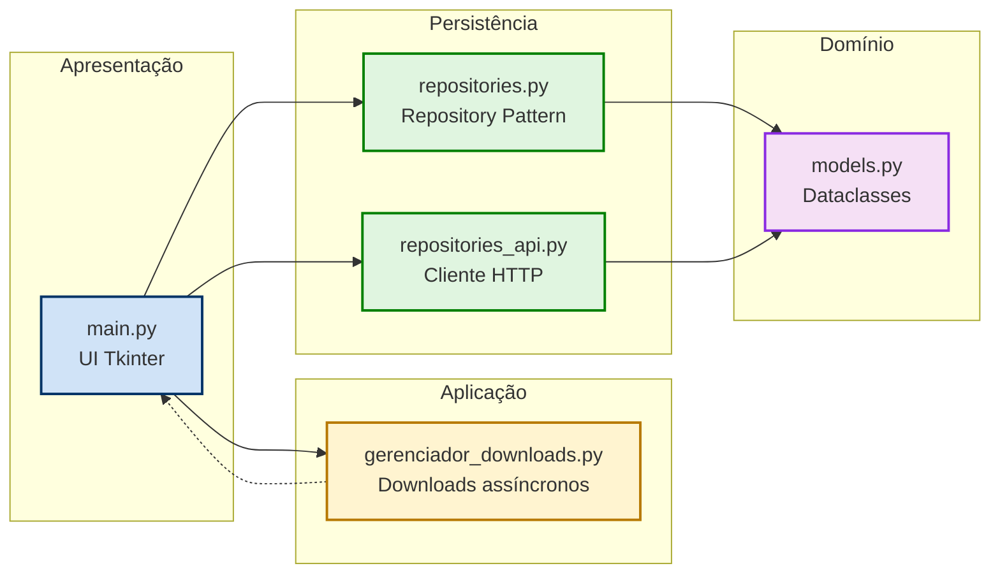
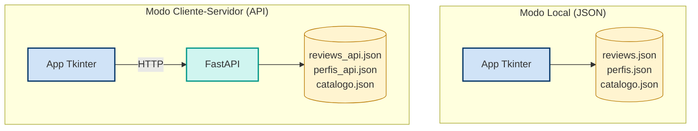
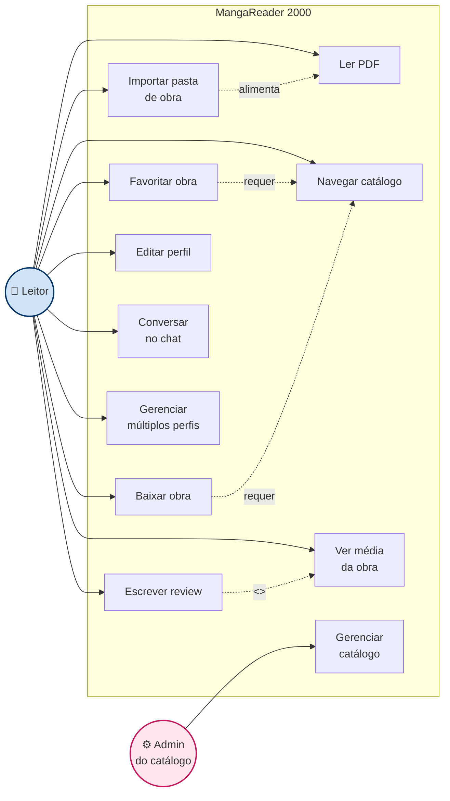
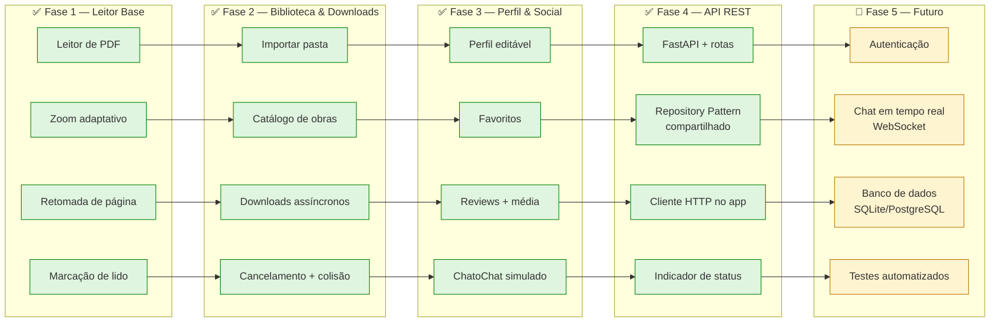

# 📖 MangaReader 2000 — Retro Edition

> Leitor de mangás e PDFs com interface inspirada na era Windows XP / 7 — projetado para incentivar o hábito da leitura com uma experiência nostálgica e fluida.


---

## 🤖 Sobre o uso de IA e Vibe Coding

Este projeto foi desenvolvido em **colaboração com modelos de linguagem (IA)** — DeepSeek, ChatGPT e Gemini — dentro de uma abordagem conhecida como **Vibe Coding**: eu descrevo o que quero, discuto arquitetura, valido decisões técnicas e a IA sugere implementações. **O julgamento técnico, as escolhas de design e a direção do projeto são meus.**

### Como a IA foi usada (e como **não** foi)

| ✅ A IA ajudou com | 🧠 O que ficou sob minha responsabilidade |
|---|---|
| Esqueleto de código repetitivo (widgets, layouts, boilerplate) | Decidir a arquitetura em 3 camadas e o Repository Pattern |
| Sugestões de nomes, mensagens de erro e UX | Definir o que o app deve fazer e para quem |
| Explicações didáticas de conceitos (Protocols, threads, HTTP, FastAPI) | Revisar, testar e corrigir tudo antes de commitar |
| Refatorações guiadas (separação em `models/`, `repositories/`, `main`) | Questionar sugestões quando não faziam sentido |
| Discussões de trade-offs entre abordagens | Aprender cada conceito antes de aplicar |

### Por que isso importa

IA é uma ferramenta como compilador, IDE ou framework. O que define um bom desenvolvedor **não é se ele usa IA**, e sim:
- Se ele **entende** o que o código faz
- Se ele sabe **quando** uma sugestão está errada
- Se ele consegue **defender** cada decisão técnica

Todo o código deste repositório foi **lido, testado e ajustado por mim**. As decisões de arquitetura estão documentadas na seção [Padrões e Decisões Técnicas](#-padrões-e-decisões-técnicas) e podem ser discutidas linha a linha.

---

## 🎯 Sobre o Projeto

**MangaReader 2000** é uma aplicação desktop desenvolvida em **Python** como projeto de estudo e portfólio de Engenharia de Software. O objetivo é oferecer um leitor de mangás/PDFs completo, com interface retrô, gerenciamento de biblioteca, catálogo de obras para download, perfil editável e funcionalidades sociais (reviews e chat).

O projeto foi construído com foco em **arquitetura limpa**, **separação de responsabilidades** e **padrões profissionais** aplicados a um domínio real — usando IA como acelerador, não como substituto do raciocínio técnico.

**Diferencial:** o app roda em **dois modos** — local (JSON) ou cliente-servidor (HTTP via API REST própria) — permitindo demonstrar desde um app desktop simples até um sistema distribuído com API própria.

---

## 📸 Screenshots

> *Substitua pelos seus prints reais. Sugestão: 3 imagens — tela inicial, catálogo com barra de progresso, tela de detalhes da obra.*

| Tela Inicial | Catálogo | Detalhes da Obra |
|---|---|---|
|  |  |  |

| API — Swagger UI | Modo API no app |
|---|---|
|  |  |

---

## 🏗️ Arquitetura

O projeto segue uma divisão em **3 camadas**, com dependências apontando em uma única direção:



### Modos de operação



A escolha do modo é feita em **1 linha** no composition root (`main.py`):
```python
MODO = "local"   # ou "api"
```

### Estrutura de arquivos

```
PDF_Reader/
├── README.md
└── PDF_Reader/
    ├── main.py                       # UI Tkinter + composition root
    ├── models.py                     # Entidades (dataclasses)
    ├── repositories.py               # Repositórios JSON (Repository Pattern)
    ├── repositories_api.py           # Cliente HTTP da API REST
    ├── gerenciador_downloads.py      # Downloads assíncronos (thread + queue)
    ├── api_teste.py                  # Ponto de entrada da API FastAPI
    ├── catalogo.json                 # Catálogo de obras
    ├── dominio/                      # Domínio autocontido da API
    │   ├── models.py
    │   ├── repositories.py
    │   └── state.py                  # Singletons compartilhados
    ├── rotas/                        # Rotas da API
    │   ├── obras.py                  # /catalogo
    │   ├── perfis.py                 # /perfis
    │   └── reviews.py                # /reviews
    ├── assets/icones/                # Ícones da toolbar
    └── pdf_padrao/                   # Biblioteca local de PDFs
```

---

## 🎬 Diagrama de Casos de Uso



**Atores:**
- **Leitor** — usuário final do app. Todos os casos de uso principais.
- **Admin do catálogo** — pessoa que mantém o `catalogo.json` (editando o arquivo diretamente, por enquanto).

**Relações:**
- `<<include>>` — Escrever review **sempre** atualiza a média da obra (composição)
- `requer` — Favoritar e Baixar precisam de uma obra no catálogo
- `alimenta` — Importar pasta torna a obra legível localmente

---

## 🗺️ Roadmap do MVP



### Escopo do MVP entregue

| Fase | Escopo | Status |
|---|---|---|
| **1. Leitor Base** | Leitura de PDF, navegação, retomada | ✅ Entregue |
| **2. Biblioteca & Downloads** | Importação local, catálogo, download assíncrono | ✅ Entregue |
| **3. Perfil & Social** | Perfis, favoritos, reviews com média, chat | ✅ Entregue |
| **4. API REST** | FastAPI, cliente-servidor, indicador de status | ✅ Entregue |
| **5. Futuro** | Autenticação, WebSocket, BD, testes | 🚧 Fora do escopo do MVP |

---

## ✨ Funcionalidades

### Leitura
- **Leitor PDF com zoom adaptativo** via `PyMuPDF` (fitz.Matrix)
- **Navegação por teclado** (setas ⬅️ / ➡️)
- **Retomada automática** da página onde parou
- **Marcação de volumes como lidos** (✔) via menu de contexto

### Biblioteca
- **Organização em 3 níveis**: Obras → Volumes → Leitor
- **Detecção automática** de obras em `pdf_padrao/`
- **Importação de pastas** do PC do usuário
- **Capas geradas** em miniatura a partir da 1ª página de cada PDF

### Catálogo & Downloads
- **Catálogo de obras** disponíveis para download
- **Downloads assíncronos** com barra de progresso (thread + `queue.Queue`)
- **Escrita atômica** — arquivos gravados como `.parcial` e renomeados só ao concluir
- **Cancelamento em cadeia** (para todos os volumes da série)
- **Tratamento de colisão** de arquivos (substituir / pular / cancelar)

### Perfil & Social
- **Perfis editáveis** com bio e foto
- **Múltiplos perfis** coexistindo no mesmo app
- **Reviews com CRUD completo** — nota, texto, edição e exclusão
- **Média das reviews** integrada ao catálogo e à biblioteca
- **Favoritos** com limite de 5 por perfil
- **ChatoChat** — chat local com preview da última mensagem

### API REST
- **Endpoints** para perfis, reviews e catálogo
- **Persistência JSON** compartilhada com o app
- **Cascade delete** — deletar perfil remove suas reviews
- **Agregações** — média de reviews por obra via `/catalogo/{id}/media`
- **Documentação automática** via Swagger UI (`/docs`)

---

## 🧠 Padrões e Decisões Técnicas

### 1. Repository Pattern
Cada tipo de dado (`Progresso`, `Perfis`, `Reviews`, `Chat`, `Catálogo`) tem seu próprio repositório. A UI **nunca** acessa arquivos ou rede diretamente — só chama métodos dos repositórios. Isso permitiu que o **mesmo app** funcione com JSON local **ou** com a API REST, mudando **1 linha**.

### 2. Injeção de Dependência
`MangaReaderRetro` recebe os repositórios pelo construtor em vez de criá-los internamente. Quem decide qual implementação usar é o composition root no `__main__` — o único ponto do projeto que sabe se os dados vivem em JSON ou em HTTP.

### 3. Protocol (PEP 544)
Cada repositório cumpre um `Protocol` que descreve os métodos esperados. Isso é **tipagem estrutural** — mais flexível que herança para permitir implementações alternativas (`RepositorioReviews` e `RepositorioReviewsAPI`) sem herdar de uma base comum.

### 4. Escrita Atômica de JSON
Todo salvamento grava em `.tmp` e depois usa `os.replace()`. Se o app travar no meio, o arquivo original permanece intacto.

### 5. Concorrência segura com Tkinter
Downloads rodam em threads separadas que **nunca tocam em widgets**. Comunicam via `queue.Queue`, e a thread principal lê a fila a cada 100ms via `root.after()`.

### 6. Singleton compartilhado na API
`dominio/state.py` instancia os repositórios **uma única vez**, e os routers importam dessa mesma fonte. Sem isso, dois routers que escrevem no mesmo arquivo JSON sobrescreveriam um ao outro.

### 7. Cliente HTTP com timeout
O `RepositorioReviewsAPI` usa `requests` com `timeout=5` obrigatório — sem isso, a UI do Tkinter travaria esperando uma resposta que pode nunca vir.

---

## 🛠️ Stack Tecnológica

| Camada | Tecnologia |
|---|---|
| Linguagem | Python 3.11+ |
| Interface Desktop | Tkinter / ttk |
| Renderização PDF | PyMuPDF (`pymupdf`) |
| Processamento de imagem | Pillow (`PIL`) |
| API REST | FastAPI + Uvicorn |
| Validação | Pydantic v2 |
| Cliente HTTP | `requests` |
| Concorrência | `threading` + `queue.Queue` |
| Persistência | JSON local (escrita atômica) |

---

## 🚀 Como Executar

### Pré-requisitos
- Python 3.11 ou superior
- pip

### Instalação

```bash
git clone https://github.com/lordepeter/PDF_Reader.git
cd PDF_Reader/PDF_Reader
pip install pymupdf pillow "fastapi[standard]" uvicorn requests
```

### Modo 1 — Local (JSON)

```bash
python main.py
```

O app roda sem servidor. Reviews, perfis e catálogo ficam em JSON local.

### Modo 2 — Cliente-Servidor (API)

**Terminal 1 — Sobe a API:**
```bash
python -m uvicorn api_teste:app --reload
```

Acesse `http://127.0.0.1:8000/docs` para ver a documentação interativa.

**Terminal 2 — Abre o app em modo API:**

Edite `main.py`:
```python
MODO = "api"
```

Depois:
```bash
python main.py
```

O indicador na toolbar mostrará **● Conectado ao servidor** (verde) se a API estiver respondendo.

### Adicionando obras locais
Coloque seus PDFs em `PDF_Reader/pdf_padrao/NomeDaObra/` — o app detecta automaticamente. Ou use **Arquivo → Importar pasta de obra...** dentro do app.

---

## 📜 Licença

Este projeto é de uso educacional e de portfólio.

Os PDFs distribuídos devem ser de **domínio público** ou de **autoria própria/independente**. O projeto não incentiva a distribuição de obras protegidas por direitos autorais.

---

## 👤 Autor

**Chumbinho**

Projeto desenvolvido como trabalho de Engenharia de Software e portfólio pessoal.

---

<p align="center">
  <i>"Só existem dois dias no ano que nada pode ser feito. Um se chama ontem e o outro se chama amanhã."</i>
  <br>— Dalai Lama
</p>
